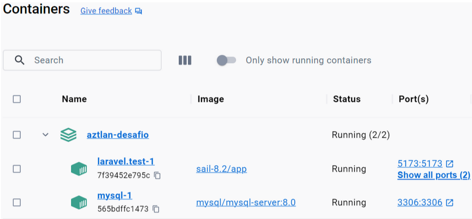

#Lista de Compras Laravel [API REST]

Background: O projeto foi desenvolvido sobre o sistema operacional Windows 11, com o uso do framework Laravel Sail, executando sobre um ambiente WSL2. Devido a sua natureza conteinerizada, o Sail deve necessitar apenas do Docker instalado para a realização de um deploy local.

Instalação: Uma vez dentro do diretório do projeto, execute os seguintes passos:
Para montar o projeto:		  	$ ./vendor/bin/sail build 
Para criar as tabelas no banco: 	$./vendor/bin/sail artisan migrate
Para executar o projeto:	  	$./vendor/bin/sail up -d
Se tudo der certo, será possível visualizar os dois contêineres que compõem o projeto: o Laravel e o MySQL, como mostra a figura abaixo:

Pode-se conferir a estrutura final esperada para as entidades do banco no diagrama ER na figura abaixo. Nessa estrutura, observa-se as entidades lista_de_compras e produtos, além de uma entidade pivot lista_de_compras_produtos, responsável por manter a relação de muitos-para-muitos entre as outras entidades. Ainda, pode-se observar as seguintes otimizações implementadas no contexto do BD:
    ##Uso de índices para as colunas que são esperadas de serem referenciadas com frequência, a fim de se proporcionar um aumento de performance no tempo de consulta a essas entidades;
    ##Uso da diretiva ON DELETE RESTRICT na entidade lista_de_compras_produto nas chaves estrangeiras relacionadas a lista_de_compras e produtos, a fim de se garantir a integridade referencial dos dados.

Utilização: Com tudo instalado e rodando, abra o navegador e vá até a URL http://localhost/api/documentation, onde deve estar disponível a documentação da API com o Swagger, como mostra a figura abaixo:
