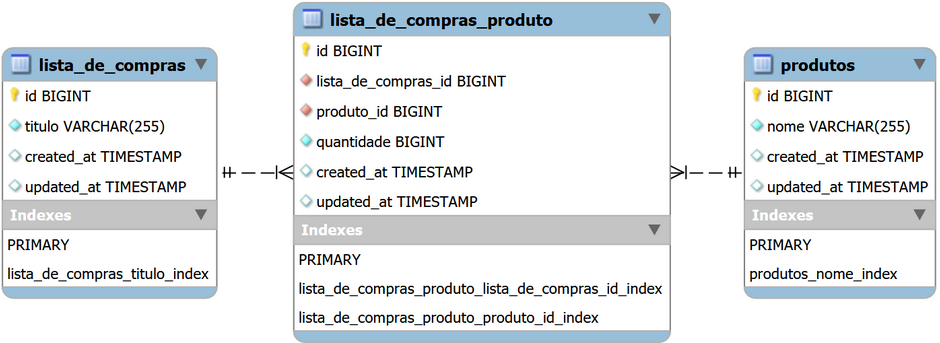
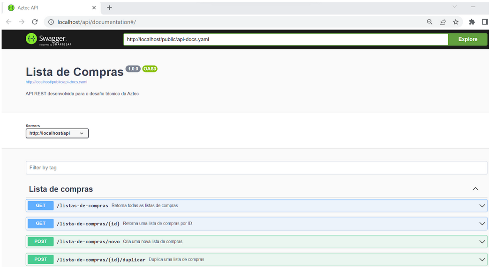

# Shopping List [REST API]

### Background:
This project was developed on Windows 11 using the Laravel Sail framework, running in a WSL2 environment. Due to its containerized nature, Sail only requires Docker to be installed for a local deployment.

### Installation:
Once inside the project directory, follow these steps:
- To build the project:  
  `$ ./vendor/bin/sail build`
- To create the database tables:  
  `$ ./vendor/bin/sail artisan migrate`
- To run the project:  
  `$ ./vendor/bin/sail up -d`

If everything is set up correctly, you will see the two containers that make up the project: Laravel and MySQL, as shown in the figure below:

You can check the expected final structure for the database entities in the ER diagram below. This structure includes the entities `lista_de_compras` (shopping list) and `produtos` (products), along with a pivot entity `lista_de_compras_produtos` that handles the many-to-many relationship between the other entities. Additionally, the following optimizations were implemented in the database context:
- Use of **indexes** on columns that are expected to be frequently referenced, to improve query performance.
- Use of the **ON DELETE RESTRICT** directive on the `lista_de_compras_produto` entity for the foreign keys related to `lista_de_compras` and `produtos`, ensuring referential data integrity.

### Usage:
With everything installed and running, open your browser and go to [http://localhost/api/documentation](http://localhost/api/documentation), where the API documentation should be available via Swagger, as shown below:

A brief description of the provided routes and their functionalities is as follows:

- **GET** `/lista-de-compras`: Returns all existing shopping lists.
- **GET** `/lista-de-compras/{id}`: Returns a shopping list by ID.
- **POST** `/lista-de-compras/novo`: Creates a new shopping list.
- **POST** `/lista-de-compras/{id}/adicionar-produto`: Adds a product to a specific shopping list.
- **POST** `/lista-de-compras/{id}/duplicar`: Duplicates a specific shopping list.
- **PATCH** `/lista-de-compras/{id}/incrementar-qtd-produto/{id_produto}`: Increments the quantity of a specific product in a specific shopping list.
- **PATCH** `/lista-de-compras/{id}/decrementar-qtd-produto/{id_produto}`: Decrements the quantity of a specific product in a specific shopping list.
- **DELETE** `/lista-de-compras/{id}/remover-produto/{id_produto}`: Removes a specific product from a specific shopping list.
- **GET** `/produtos`: Returns all products.
- **POST** `/produtos/novo`: Creates a new product.
